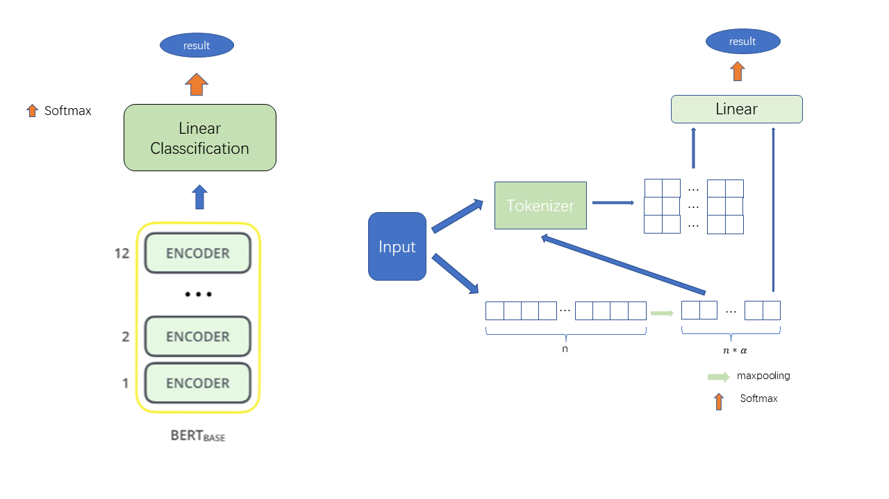
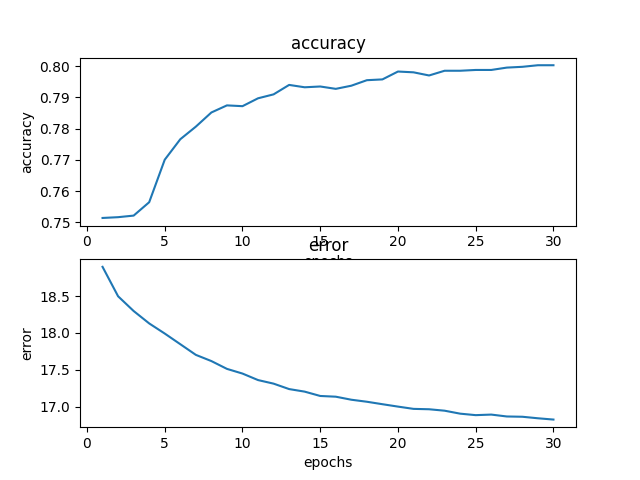

# Explainable Detection of Online Sexism a deep-learning based online comments.

Welcome! To deal with this task, we propose two typical models, which are one based on "bert" and another one based on "Loglinear". We also build a series of functions to train these models and test their performance in real situations. Now, let's begin our journel.



## Installation

1.Instal the python environment.

Python(python==3.6), PyTorch(torch >= 1.10.0), torchaudio(1.10.0), torchvision(0.11.1), cudnn113, matplotlib(3.3.4)...

For convinece, we can just import the environment via anaconda and pip. Here are two ways.

```bash
conda env create -f ./env/py36.yaml
```
or 
```bash
pip install -r ./env/env.txt

```

2.Usage

To use the platform, we can use the following code.

```bash
python main.py -h
```

or we can see the default function(train a model based on bert+fc)

```bash
python main.py
```

## Code Structure

If you want to learn more about my code, here are my code's sturcture and their use.

- main.py
  
  This file is the API file. It contains the arguments for users to change to fit their wish. By the way, due to my poor programming ability, the loss function is defined in this file instead of utils.py.
- model.py
  
  This file contains all the model based on bert. Yes, just like this.
- MyDataLoader.py
  
  This file contains the Dataset of bert model. If you want to know what about where the Dataset of Loglinear model locates, please be patient and continue to read.
- Loglinear.py
  
  This file contains everything about the Loglinear model, including the model, Dataset and its tokenzier. This is because I didn't prepare writing this model at first.
- utils.py
  
  This file contains the traing code, validation code, preprocess code and some tool functions.
- tutorial.ipynb
  
  This is just a tutorial.(To be continued...)

## Performance

This is the performance of Loglinear model in 30 epochs.



My experiment shows that the bert+fc model shows a little bit worse than Loglinear model.(Only 79~80) In my opinion, this is because the number of features is too small(only 768 compared to the Loglinear model > 3000).

I can't get the result of bert-large+fc model, because my computer is a little bit poor. It will shut down after two or three epochs.

## Citations

[Bert-base-uncased](https://huggingface.co/bert-base-uncased)

[Bert-Large-uncased](https://huggingface.co/bert-large-uncased)